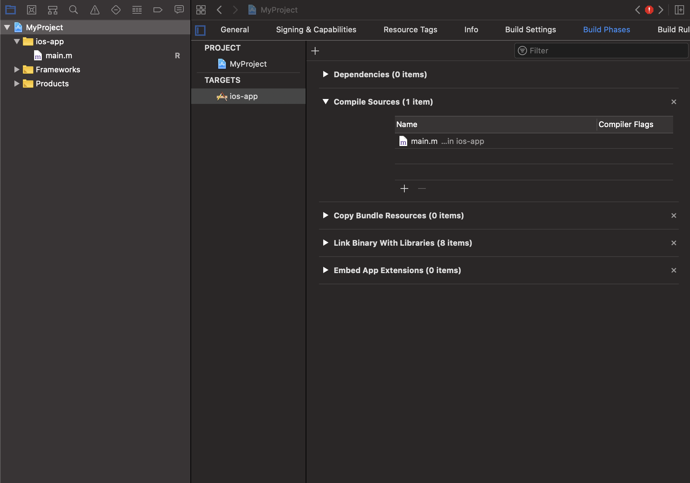

# Bazel for iOS Developers

This document is an introduction to Bazel for iOS developers. There's been many
docs written about Bazel online. This document is geared towards an iOS
application developer coming from Xcode and intends to be a lightweight
introduction and map familiar concepts.

The document supplements canonical Bazel resources:
- [Bazel overview](https://docs.bazel.build/versions/master/bazel-overview.html)
- [A tutorial for iOS apps](https://docs.bazel.build/versions/master/tutorial/ios-app.html) 
- [Bazel Concepts and terminology](https://docs.bazel.build/versions/master/build-ref.html)
- [Getting started with Bazel](https://docs.bazel.build/versions/master/getting-started.html) 

## Build systems for iOS developers

First, let's address the definiton of a `Build system`. According to [Stack
overflow](https://stackoverflow.com/questions/7249871/what-is-a-build-tool_),
_Build tools are programs that automate the creation of executable applications
from source code(eg. .apk for android app). Building incorporates
compiling,linking and packaging the code into a usable or executable form._

In iOS development, Apple encapsulates build systems inside of Xcode. Xcode is
both the IDE _and build system_. For many developers, Xcode just works. To have
a good experience, most developers don't need to worry about implementing build
systems, IDEs, or compilers. When the project scales, developer experience
drops off. Tasks like building, indexing, or merging a change that adds a new
file can become painful. 

Bazel makes it easy to manage build configuration in a way that results are
functional and reproducible. In addition to producing an iOS application, Bazel
makes it easy to automate many other kinds tasks for example, code generating a
thrift schema, generating an Xcode project, and pushing a docker container.
Having the ability to optimize the build system can significantly improve the
developer experience.

Compared to other mainstream build systems, Bazel is strict about inputs and
outputs. This characteristic makes it reproducible and well suited for
distributed cloud builds and caching. In 2018, Microsoft came out with a paper
that compares popular build systems, [Build Systems à la
Carte](https://www.microsoft.com/en-us/research/uploads/prod/2018/03/build-systems.pdf).

## Introduction to Bazel projects

The root of a Bazel project contains 2 key human readable files

The `BUILD` file - these files define what targets are inside of a project.
Applications, extensions, static libraries, and frameworks are all declared in
BUILD files.

The `WORKSPACE` file - this file is about getting files and dependencies from
[outside the world into
Bazel](https://docs.bazel.build/versions/master/be/workspace.html).  Simply
put, external-to-bazel dependencies are put here. 

_The closest notion to BUILD files in the Xcode world, is the machine readble
`xcodeproj` files managed by Xcode._

## WORKSPACE configuration and setting up rules_apple

For building iOS applications, most iOS developers use the rule set
`rules_apple`. `rules_apple` contains key rules for iOS development which
includes rules to build applications, unit tests, and more.

Head to [rules_apple](https://github.com/bazelbuild/rules_apple) and follow the
latest instructions to get setup. `rules_apple` provides instructions to add
dependencies into the `WORKSPACE` file. Simply paste the lines from
`rules_apple`'s README into the `WORKSPACE` file

```
# /path/to/myproject/WORKSPACE
load("@bazel_tools//tools/build_defs/repo:git.bzl", "git_repository")

git_repository(
    name = "build_bazel_rules_apple",
    remote = "https://github.com/bazelbuild/rules_apple.git",
    commit = "[SOME_HASH_VALUE]",
)
```

The first line of code calls the function, `load`. The load function imports
symbols from a `.bzl` file.  In Objective-C or swift, it's like importing a
header file.

```
load("@bazel_tools//tools/build_defs/repo:git.bzl", "git_repository")
```
_load `git_repository` from the internal [bazel tools](https://github.com/bazelbuild/bazel/issues/4301) repository_

The next line of code calls `git_repository` defines `build_bazel_rules_apple`
from the git repository, `https://github.com/bazelbuild/rules_apple` for a
given `commit`. 

_`git_repository` documentation https://docs.bazel.build/versions/2.0.0/repo/git.html_

### BUILD files

`BUILD` files are where all the targets are defined.

First, let's walk through creating a basic iOS application. In the root of the
project, let's create the `BUILD` file. First, a library for the iOS
application sources. The following code defines an `objc_library`, `sources`.
In Xcode this is similar to navigating in the GUI and hitting `File -> New
Target` 

```
# /path/to/myproject/BUILD
objc_library(
    name="sources",
    srcs=["main.m"]
)
```

Next, create the application target with `rules_apple`'s `ios_applicaiton` rule.
```
# /path/to/myproject/BUILD
...
load("@build_bazel_rules_apple//apple:ios.bzl", "ios_application")
ios_application(
    name = "ios-app",
    bundle_id = "com.bazel-bootcamp.some",
    families = ["iphone"],
    infoplists = ["Info.plist"],
    minimum_os_version = "[MINIMUM VERSION]",
    # Add `sources` as a dependency
    deps = [ ":sources" ],
)
```

The`ios_application` and `objc_library` targets together would be represented
in Xcode as:



### Rules

In the previous segment, we created an iOS application with a single BUILD
file. The `ios_application` rule is implemented by `rules_apple` and the
`objc_library` is a native rule.

A target is an instance of a rule. Rules implement business logic for how the
iOS application is built by creating actions. actions represent invocations of
extenal command line programs like `clang` or `bash`. Typical projects contain
many rules, targets, and BUILD files.

```
BUILD file -> target -> rule -> action -> execution
```

Bazel and open source rules should provide most functionality to build an iOS
application. Generally, defining custom rules isn't required but can improve
and consolidate functionality. To learn more about how to create custom rules,
the document, [Bazel extensions](https://docs.bazel.build/versions/master/skylark/concepts.html)
contains a comprehensive overview.
	
### Command line usage

In Xcode, command line builds are achieved through the command line interface
`xcodebuild`.  to build the scheme `ios-app` from `MyProject.xcworkspace`,
`xcodebuild`, would be invoked as:

```
xcodebuild -workspace MyProject.xcworkspace -scheme ios-app
```

Bazel exposes a command line which can also do builds. In Bazel, _every_ target
is in the global WORKSPACE and there is no notion of schemes.
```
bazel build ios-app
```

The Bazel command line has hundreds of options, which can be found in the
[Bazel
documentation](https://docs.bazel.build/versions/master/command-line-reference.html).
For iOS developers, a set of useful flags is available at
[bazel-ios-users](https://github.com/ios-bazel-users/ios-bazel-users/blob/master/UsefulFlags.md).

In addition to the default bazel options, it's common to create custom
configuration settings to customize builds, so the possible Bazel command line
permutations are endless.

For example, the following build file has conditional `copts` on `:app_store`

```
objc_library(
   name = "some",
   srcs = ["some.m"],
   copts = select({
      # For app_store we need to build `some.m` with a special copt
      ":app_store": ["-DAPPSTORE=1"],
      "//conditions:default": [],
    })
)
config_setting(
    name = "app_store",
    values = { "app_store" : "true" }
)
```

This is passed in as a define to Bazel
```
bazel build ios-app --define app_store=true
```

For more information about `config_setting`, please see the [Bazel
documentation](https://docs.bazel.build/versions/master/be/common-definitions.html#configurable-attributes).

### Configuration of libraries and flags via macros

Most users of Bazel implement a higher level system of macros to encapsulate
defaults of building librarys and simplify configuration management. 

Bazel provides the pythonic programming language Starlark to implement such
build system logic. Like rules and aspects, macros are defined in `.bzl` files.
A macro is a convenient way to call a rule, and not recognized by Bazel in the
same way a rule is.

_Note: The main distinction between a `.bzl` and a `BUILD` file is `BUILD` files are
used to create targets by calling macros and rules. `.bzl` files define the
implementation._

To create a wrapper for `objc_library`, create the file `objc_library.bzl`. The
following macro restricts the customization, and enforces defaults of the
native `objc_library` rule.

```
def objc_library(name, srcs=[], hdrs=[], deps=[], data=[]):
    """
    An objc_library that turns on pedantic warnings,
    and enables modules
    """
    native.objc_library(
        name=name,
        deps=deps,
        data=data,
        srcs=srcs,
        hdrs=hdrs,
        enable_modules=True,
        copts=[
            "-Wpedantic"
        ]
    )
```

By loading our `objc_library` into a `BUILD` file, it will override the native
`objc_library` rule, which is automatically imported.
```
load(":objc_library.bzl", "objc_library")

# This calls the custom objc_library, and will error out on `copts`
objc_library(name="some", copts=["-DSOME"])
```

The same principals can be applied to many rules: wrapping macros with macros.
With Starlark, the possibilities are endless! _technically they are endless as
the language is not turing complete_. Please see the
[`objc_library`](https://docs.bazel.build/versions/master/be/objective-c.html)
documentation for all possible arguments. _Note: Unlike Starlark rules which
are easily added on to Bazel, the `objc_library` is part of the internal java
rules shipped with the Bazel
binary._ 

### Toolchains

In additional to configuring the build with rules, bazel provides a additional
primitive, the toolchain. Toolchains provide default compilers and arguments
for those compilers. For the native c++ rules, this is relied upon to configure
the many flags required for cross compilation.

For most iOS projects, updating isn't generally required but it gives full
control over compiler invocations, and replacing the compiler being invoked.
Please see the [toolchain
documentation](https://docs.bazel.build/versions/master/tutorial/cc-toolchain-config.html)
to learn more.

### Generated Xcode projects

In an Xcode world, folks checked in a project which contains an listing of
files, build settings, and IDE state. When the project scales, the project file
model breaks down. Auditing and code reviewing config changes in Xcode projects
quickly becomes difficult. With Bazel, human readable `BUILD` files are the
source of truth for build and Xcode configuration. Tools like
[XCHammer](https://github.com/pinterest/xchammer), and
[Tulsi](https://github.com/bazelbuild/tulsi) use an aspect to traverse the
build graph and extract metadata required to generate a project.  These tools
make it easier to manage the project and generate on demand - not needing to
check it in.

XCHammer provides a rule to [bazel build Xcode
projects](ihttps://github.com/pinterest/xchammer#bazel-build-xcode-projects).
Simply declare the rule with the project and Bazel build the target.
```
load("@xchammer_resources//:xcodeproject.bzl", "xcode_project")
xcode_project(
    name = "MyProject",
    targets = [ "//ios-app:ios-app" ],
    paths = [ "**" ],
)
```

Like any other Bazel target, it's built from the command line
```
bazel build :MyProject
```

The rule definition for the `xcode_project` may be found in the [github
repository](https://github.com/pinterest/xchammer/blob/master/BazelExtensions/xcodeproject.bzl).
Simply put, the aspect traverses sources, and invokes the `xchammer` binary with
a JSON file. Internally, XCHammer instantiates
[`XcodeGen`](https://github.com/yonaskolb/XcodeGen) types and writes them out to
disk with `xcodeproj`.

The workflow for generating an Xcode project with XCHammer is quite simple:
```
command line -> bazel -> rule -> xchammer -> xcodegen -> xcodeproj
```

Generators like XCHammer and Tulsi take care of integrating Bazel into the IDE.
Bazel builds are invoked a shell script build phase from the IDE. Basically,
Xcode shells out to Bazel to produce the application, and then Xcode picks up
the product from the derived data path. Performing a Bazel build from Xcode.
```
play button -> shell script build phase -> bazel build ios-app
```


### Fixing common Bazel errors

This segment indicates how to fix a basic Bazel error. Bazel has a few levels of
validation which often occur at BUILD time. Note that since Bazel doesn't type
check all files in the WORKSPACE on every build it's possible to have an error
in 1 target, while other targets still work.

```
ERROR: /Users/jerrymarino/Projects/xchammer-github/BUILD.bazel:4:13:
objc_library() got unexpected keyword argument: copts
```

In the above code, a rule author defined a custom `objc_library` which only
exposed the parameters name, srcs, hdrs, deps, and data. This is notated by the
file path `/Users/jerrymarino/Projects/xchammer-github/BUILD.bazel` at the line
`4:13` where the error occurred. _This is very similar to how clang and swift
errors look and feel inside of Xcode_ 

If needed, Bazel generally will indicate the `.bzl` file where the issue
occurred and `BUILD` file that created the error in a call stack like fashion.

To actually fix this error, simply remove the unsupported argument `copts`.

### Building CocoaPods with Bazel

`PodToBUILD` provides a WORKSPACE rule to make it easy to build CocoaPods with
Bazel. It loads in sources, and by reading in a Podspec file, it can generate a
BUILD file. Find out more information about [PodToBUILD on
github](https://github.com/pinterest/PodToBUILD). 


## More information

This concludes the introduction. The Bazel documentation
contains in depth tutorials, knowledge, and documentation.

- [Rules](https://docs.bazel.build/versions/master/rules.html)
- [Encyclopedia](https://docs.bazel.build/versions/master/be/overview.html)
- [Starlark](https://docs.bazel.build/versions/master/skylark/language.html)

If there's additional bullet points useful for iOS developer onboarding, please
send a pull request. 
