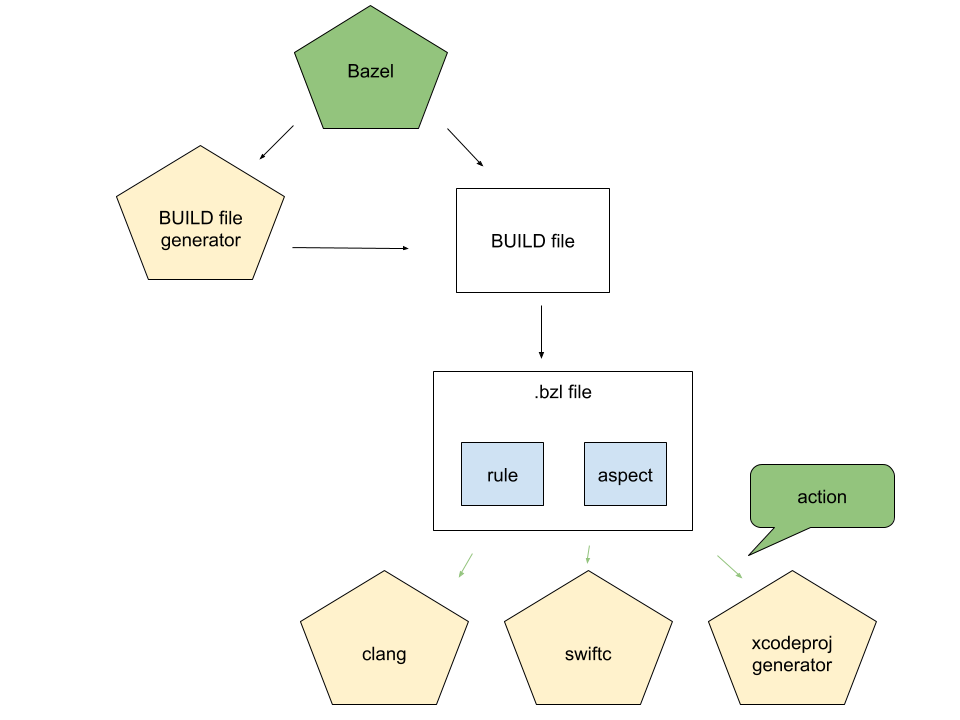

# Bazel for iOS Developers

This document is an introduction to Bazel for iOS developers. While there's
been many docs written about Bazel, the existing material can be overwhelming
for a line engineer looking to get started. This document is geared towards an
iOS developer coming from Xcode and intends to be a lightweight and therefore
incomplete introduction to Bazel.

It supplements canonical Bazel resources, linked in the [conclusion](#conclusion).

## Table of contents

* [Bazel for iOS Developers](#bazel-for-ios-developers)
  * [Table of contents](#table-of-contents)
  * [Build systems for iOS developers](#build-systems-for-ios-developers)
  * [Bazel projects](#bazel-projects)
     * [Setting up a WORKSPACE](#setting-up-a-workspace)
     * [Adding an iOS application with BUILD files](#adding-an-ios-application-with-build-files)
     * [Bazel command line](#bazel-command-line)
     * [Configurable build attributes](#configurable-build-attributes)
     * [Compiler configuration](#compiler-configuration)
  * [Extending Bazel](#extending-bazel)
     * [Starlark](#starlark)
     * [Rules](#rules)
     * [Macros](#macros)
     * [Aspects](#aspects)
     * [Toolchains](#toolchains)
     * [Generated Xcode projects](#generated-xcode-projects)
     * [BUILD file generators](#build-file-generators)
  * [Putting it all together - build system architecture](#putting-it-all-together---build-system-architecture)
  * [More information](#more-information)
     * [Gathering information with Bazel query](#gathering-information-with-bazel-query)
     * [Fixing common Bazel errors](#fixing-common-bazel-errors)
     * [Installing Bazel](#installing-bazel)
  * [Conclusion](#conclusion)
  * [Acknowledgements](#Acknowledgements)


## Build systems for iOS developers

First, let's address the definiton of a "Build system". According to [Stack
overflow](https://stackoverflow.com/questions/7249871/what-is-a-build-tool_):
> Build tools are programs that automate the creation of executable applications
> from source code (e.g., `.apk` for an Android app). Building incorporates
> compiling,linking and packaging the code into a usable or executable form.

In iOS development, Apple encapsulates build systems inside of Xcode. Xcode is
both the IDE _and build system_. For many developers, Xcode just works. To have
a good experience, most developers don't need to worry about implementing build
systems, IDEs, or compilers. When the project scales, developer experience
drops off. Tasks like building, indexing, or merging a change that adds a new
file can become painful.

Bazel can fix many problems with iOS builds when done well. First, Bazel is
strict about inputs and outputs - they must be declared. This property, known as
"hermetic" builds, makes builds reproducible and well-suited for distributed
cloud builds and caching. For developers, this means better performance due to
cache hitting and not constantly removing derived data. Clean builds become
incremental, decades of CPU cycles saved.

Bazel puts the user in full control over the build. First, it's extensibility
model allows the user to implement build system logic: for example the business
logic of bundling an iOS application [external to the
core](https://github.com/bazelbuild/rules_apple). Bazel is also [on GitHub](https://github.com/bazelbuild) and
open source.  For developers, this means full control over the build,
visibility into changes, visibility into how it works, and empowerment to fix
issues and report bugs. These notions are contrary to the Xcode model which
works as Apple intended and optimized for.

Bazel also makes it easy to automate _other_ kinds tasks: for example, code
generating a thrift schema, [generating an Xcode
project](https://github.com/pinterest/xchammer), or [pushing a Docker
container](https://github.com/bazelbuild/rules_docker). [Starlark](#Starkark)
(Bazel's built-in, deterministic, Python-like programming language) allows
developers to implement custom build logic. For developers this means better
performance and pulling in out-of-band ad-hoc build scripts into a directed
build graph that builds as a unit.

_To learn about how Bazel compares to other build systems, Microsoft's paper
[Build Systems à la
Carte](https://www.microsoft.com/en-us/research/uploads/prod/2018/03/build-systems.pdf),
compares popular build systems._

## Bazel projects

The root of a Bazel project contains two human-readable files:

The `BUILD` file: defines what targets are inside of a project.
Applications, extensions, static libraries, and frameworks are all declared in
`BUILD` files.

The `WORKSPACE` file: references files and dependencies from
[the outside world into
Bazel](https://docs.bazel.build/versions/master/be/workspace.html).  Simply
put, external-to-the-repository dependencies are put here.

_In the Xcode world, build configuration is governed by the Xcode GUI and
stored in the machine readable `xcodeproj` files._

### Setting up a WORKSPACE

For building iOS applications, most iOS developers use the rule set
`rules_apple`. `rules_apple` contains key [rules](#rules) for iOS development which
includes rules to build applications, unit tests, and more.

Head to [rules_apple](https://github.com/bazelbuild/rules_apple) and follow the
latest instructions to get setup. `rules_apple` provides instructions to add
dependencies into the `WORKSPACE` file. Simply paste the lines from
`rules_apple`'s README into the `WORKSPACE` file

```
# /path/to/myproject/WORKSPACE
load("@bazel_tools//tools/build_defs/repo:git.bzl", "git_repository")

git_repository(
    name = "build_bazel_rules_apple",
    remote = "https://github.com/bazelbuild/rules_apple.git",
    commit = "[SOME_HASH_VALUE]",
)
```

The first line of code calls the function, `load`. The load function imports
symbols from a `.bzl` file.  It's like importing a header file
in Objective-C or Swift. _Note:
[Bazel_tools](https://github.com/bazelbuild/bazel/issues/4301) is a repository
shipped with Bazel and commonly used in the WORKSPACE_


```
load("@bazel_tools//tools/build_defs/repo:git.bzl", "git_repository")
```
_load `git_repository` from the internal [bazel tools](https://github.com/bazelbuild/bazel/issues/4301) repository_

The next line of code calls `git_repository` and defines the repository
`build_bazel_rules_apple` from the git repository,
`https://github.com/bazelbuild/rules_apple` for a given `commit`.

### Adding an iOS application with BUILD files

`BUILD` files are where all the targets are defined. For Apple developers, this
often includes apps: [`ios_application`](https://github.com/bazelbuild/rules_apple/tree/master/doc)'s, tests: [`ios_unit_test`/`ios_ui_test`](https://github.com/bazelbuild/rules_apple/tree/master/doc), app extensions: [`ios_extension`](https://github.com/bazelbuild/rules_apple/tree/master/doc), frameworks: [`ios_framework`](https://github.com/bazelbuild/rules_apple/tree/master/doc), and libraries: [`objc_library`](https://docs.bazel.build/versions/master/be/objective-c.html), [`swift_library`](https://github.com/bazelbuild/rules_swift/tree/master/doc).

First, let's walk through creating a basic iOS application. In the root of the
project, let's create the `BUILD` file. First, a library for the iOS
application sources. The following code defines an `objc_library`, `sources`.

```
# /path/to/myproject/BUILD
objc_library(
    name="sources",
    srcs=["main.m"]
)
```

Next, create the application target with `rules_apple`'s `ios_application` rule.
```
# /path/to/myproject/BUILD
...
load("@build_bazel_rules_apple//apple:ios.bzl", "ios_application")
ios_application(
    name = "ios-app",
    bundle_id = "com.bazel-bootcamp.some",
    families = ["iphone"],
    infoplists = ["Info.plist"],
    minimum_os_version = "[MINIMUM VERSION]",
    # Add `sources` as a dependency
    deps = [ ":sources" ],
)
```

In Xcode this is similar to navigating in the GUI and hitting `File -> New
Target`. Together, the `ios_application` and `objc_library` targets together
would be represented in Xcode as:


### Bazel command line

In Xcode, command line builds are achieved through the command line interface
`xcodebuild`.  to build the scheme `ios-app` from `MyProject.xcworkspace`,
`xcodebuild`, would be invoked as:

```
xcodebuild -workspace MyProject.xcworkspace -scheme ios-app
```

Bazel exposes a command line which can also do builds. In Bazel, _every_ target
is in the global WORKSPACE and there is no notion of schemes.

```
bazel build ios-app
```

The Bazel command line has hundreds of options, which can be found in the
[Bazel
documentation](https://docs.bazel.build/versions/master/command-line-reference.html).
For iOS developers, a set of useful flags is available at
[bazel-ios-users](https://github.com/ios-bazel-users/ios-bazel-users/blob/master/UsefulFlags.md).

### Configurable build attributes

In addition to the default Bazel options, it's common to create custom
configuration settings to customize builds. Together, `select` and
`config_setting` yield configurable build attributes.

For example, unavoidable requirements could require an `objc_library` to
be compiled differently when building for the appstore. The following build
file has conditional `copts` on `:app_store`.

```
objc_library(
   name = "some",
   srcs = ["some.m"],
   copts = select({
      # For app_store we need to build `some.m` with a special copt
      ":app_store": ["-DAPPSTORE=1"],
      "//conditions:default": [],
    })
)
config_setting(
    name = "app_store",
    values = { "app_store" : "true" }
)
```

This can be set as a define and passed to Bazel on the command line. Other variables in the build may also switch on `app_store`.

```
bazel build ios-app --define app_store=true
```

`config_setting` may hinge on other settings as well. For example, in
PodToBUILD, we set the `config_setting`,
[`release`](https://github.com/pinterest/PodToBUILD/blob/master/IntegrationTests/GoldMaster/Bolts.podspec.json.goldmaster#L13).

When the users passes `opt` to the compiler, it implicates that
`DNS_BLOCK_ASSERTIONS=1` and `-POD_CONFIGURATION_RELEASE=1` are set.
```
config_setting(
  name = "release",
  values = {
    "compilation_mode": "opt"
  }
)
...
objc_libray(
...
  copts = [...
  ] + select(
    {
      "//conditions:default": [
        "-DDEBUG=1",
        "-DPOD_CONFIGURATION_DEBUG=1"
      ],
      ":release": [
        "-DPOD_CONFIGURATION_RELEASE=1",
        "-DNS_BLOCK_ASSERTIONS=1"
      ]
    }
  )
```

For more information about `select` and `config_setting`, please see the [Bazel
documentation](https://docs.bazel.build/versions/master/be/common-definitions.html#configurable-attributes).

### Compiler configuration

In Xcode there are a plethora of configuration options, known as xcconfig, that
implicate different compiler flags. xcconfigs are a makefile like syntax to
configure Xcode build behavior. Xcode evalutes xcconfigs to peform actions in a
way that is unmodifiable by the user. Bazel doesn't have xcconfigs and puts the
user in full control of the build through settings, rules, aspects, toolchains
and open source code.

In Bazel, `toolchains`, `objc_library`, `swift_library`, and `bazelrc` all configure flags.

#### Library Level

The parameter `copts` passes flags directly to the compiler. This parameter is
useful for the per-rule configuration. Simply put, it's useful for when `copts`
should apply to a single target but not all targets. Many projects use macros
and other layers of abstraction to [unify library level configuration](#Macros)
for subsets of targets.

This parameter is prominit in the native C++ rules, for example the
`objc_library` rule. Please find canonical documentation on `copts` on the
[Bazel
docs](https://docs.bazel.build/versions/master/be/objective-c.html#objc_library.copts).

In the rule set, `rules_swift`, the parameter `copts` is also available. The
behavior is similar to the native C++ rules `copts` parameter in that it passes
the variables directly to `swiftc`  For more information about `swift_library`
please see the [`rules_swift`
documentation](https://github.com/bazelbuild/rules_swift).

#### Bazelrc level

Useful to set global defaults, The `bazelrc` file format allows setting
compiler flags through the flags, `copt` for all c language compilation,
`swiftcopt` for swift compilation, and `linkopt` for linker actions. Please see
the [Bazel
documentation](https://docs.bazel.build/versions/master/command-line-reference.html)
for more information.

#### Toolchain level

The `local_config_cc` toolchain enables architecture specific and global flag
setting. This is useful when flags should apply at a per-architecture level.
Note: Bazel uses this to set default flags globally. Most iOS applications won't
need a toolchain, but this is a way to achieve it.

The `local_config_cc` is also a useful place to pass additonal files to the
compiler like example clang plugins. This is ideal, as specifying the plugin
argument in `.bazelrc` without adding the file as an input would result in an
non-hermetic build.

## Extending Bazel

### Starlark

Bazel provides the python-like programming language, Starlark. Starlark is used
to implement build system logic and establish norms.  Generally, Starlark calls
into functionality that's implemented within Bazel. The coming segments
[rules](#rules), [macros](#macros), and [aspects](#aspects) cover several
examples.

```
.bzl file -> starlark -> bazel functions
```

Starlark enables extensibility without needing to fork the core build system.
This boundary helps the developer to focus on their business logic instead of
the core of the build system. For example, the Apple-specific logic of bundling
an `ios_application` is defined outside Bazel's core by `rules_apple`.

With Starlark, the possibilities are endless. _technically they aren't endless
as the language is not Turing complete_. For more information, please see the
[Starlark
documentation](https://docs.bazel.build/versions/master/skylark/language.html).


### Rules

Rules implement business logic for how the iOS application is built by creating
actions. Actions represent invocations of external command line programs like
`clang` or `bash`. Instances of rules are targets. Typical projects contain many
rules, targets, and BUILD files.

> A rule defines a series of actions that Bazel performs on inputs to produce a set of outputs.

_- [the bazel documentation](https://docs.bazel.build/versions/master/skylark/rules.html)_


In the previous segment, we created an iOS application with a BUILD file.
The `ios_application` rule is implemented by `rules_apple` and the
`objc_library` is a native rule. Native rules are implemented in Java, have
more power and capabilities needed to implement core functionality (like remote
execution and C++ compilation), and are generally used as-is.

```
BUILD file -> rule -> action -> execution
```
_A build file instantiates rules as targets which create actions that are
executed by [Skyframe](https://bazel.build/designs/skyframe.html)_

Bazel and open source rules should provide most functionality to build an iOS
application. Generally, defining custom rules isn't required but can improve and
consolidate functionality. To learn more about how to create custom rules, the
document, [Bazel
extensions](https://docs.bazel.build/versions/master/skylark/concepts.html)
contains a comprehensive overview.

### Macros

Like [rules](#Rules) and [aspects](#Aspects), macros are defined in `.bzl`
files.  A macro is a convenient way to call a rule, and not recognized by Bazel
in the same way a rule is. As Bazel builds targets, instantiated by rules, it can't
"build" a macro. A macro is evaluated during the evaluation of a BUILD file and
instantiates rules. Once the macro is translated into a rule, the macro is
irrelevant to the build process. In C++ compilation, this behavior is similar
to the pre-processor feature of the compiler. Please see the coming example.

_Note: The main distinction between a `.bzl` and a `BUILD` file is `BUILD` files are
used to create targets by calling macros and rules. `.bzl` files define the
implementation._

Most users of Bazel implement a higher level system of macros to encapsulate
defaults of building libraries and simplify configuration management. To create
a wrapper for `objc_library`, create the file `objc_library.bzl`. The following
macro restricts the customization, and enforces defaults of the native
`objc_library` rule.


```
def objc_library(name, srcs=[], hdrs=[], deps=[], data=[]):
    """
    An objc_library that turns on pedantic warnings,
    and enables modules
    """
    native.objc_library(
        name=name,
        deps=deps,
        data=data,
        srcs=srcs,
        hdrs=hdrs,
        enable_modules=True,
        copts=[
            "-Wpedantic"
        ]
    )
```

By loading our `objc_library` into a `BUILD` file, it will override the native
`objc_library` rule, which is automatically imported. This is ideal because it
prevents users from accidentally using `native.objc_library` when they should
be using the one that prevents overriding `copts`. This pattern is also used in
[`rules_python`](https://github.com/bazelbuild/rules_python).

```
load(":objc_library.bzl", "objc_library")

# This calls the custom objc_library macro. Thankfully, building this with
# Bazel will error out due to the unavailable argument `copts` used here.
objc_library(name="some", copts=["-DSOME"])
```

The same principles can be applied to many rules: wrapping macros with macros.
Please see the
[`objc_library`](https://docs.bazel.build/versions/master/be/objective-c.html)
documentation for all possible arguments. _Note: Unlike Starlark rules which
are easily added on to Bazel, the `objc_library` is part of the internal Java
rules shipped with the Bazel
binary._

_In the Xcode world, configuration is defined by Xcode projects and proprietary
xcconfig. In Bazel it's easy to establish conventions and enforce consistency
with abstractions like `objc_library`, and refactor_

### Aspects

Aspects are another extension point in Bazel. Simply put, they allow the
developer to traverse the build graph and collect information or generate
actions on the way.

> Aspects are a feature of Bazel that are basically like fan-fic, if build rules
were stories: aspects let you add features that require intimate knowledge of
the build graph, but that that the rule maintainer would never want to add.

_- [Kristina Chodorow, Aspects: the fan-fic of build rules](https://kchodorow.com/2017/01/10/aspects-the-fan-fic-of-build-rules/)_

Combined with rules and the Bazel command line, the user is able to create robust
architectures and powerful abstractions. Like rules, generally, defining custom
rules isn't required but can improve and consolidate functionality. For more
information about aspects, see [Aspects the fan-fic of build
rules](https://kchodorow.com/2017/01/10/aspects-the-fan-fic-of-build-rules/)

### Toolchains

In addition to configuring the build with rules, Bazel provides an additional
primitive: the toolchain. Toolchains provide default compilers and arguments
for those compilers. For the native C++ rules, toolchains configure
the many flags required for cross compilation.

For most iOS projects, configuring the C++ toolchain isn't required. Defining a
custom toolchain gives full control over compiler invocations or
to customize the compiler being invoked.  Please see the [toolchain
documentation](https://docs.bazel.build/versions/master/tutorial/cc-toolchain-config.html)
to learn more.

### Generated Xcode projects

In an Xcode world, engineers check in a project file, which contains a listing
of source files, build settings, and IDE state. As the codebase scales, the
project file model breaks down, particularly when auditing and code reviewing
config changes. With Bazel, Xcode projects are generated on the developer's
machine. By generating transient projects locally, merge conflicts don't slow
down development. Generated projects make it easier to review and reason about
configuration changes in readable BUILD and .bzl files. With Bazel, human
readable `BUILD` files are the source of truth for build and Xcode
configuration.

Tools like [XCHammer](https://github.com/pinterest/xchammer), and
[Tulsi](https://github.com/bazelbuild/tulsi) use an aspect to traverse the
build graph and extract metadata required to generate a project.  These tools
make it easier to manage the project and generate on demand - not needing to
check it in.

XCHammer provides a rule to [bazel build Xcode
projects](ihttps://github.com/pinterest/xchammer#bazel-build-xcode-projects).
Simply declare the rule with the project and Bazel build the target.
```
load("@xchammer_resources//:xcodeproject.bzl", "xcode_project")
xcode_project(
    name = "MyProject",
    targets = [ "//ios-app:ios-app" ],
    paths = [ "**" ],
)
```

Like any other Bazel target, it's built from the command line:
```
bazel build :MyProject
```

The rule definition for the `xcode_project` may be found in the [github
repository](https://github.com/pinterest/xchammer/blob/master/BazelExtensions/xcodeproject.bzl).
Simply put, the aspect traverses sources, and invokes the `xchammer` binary with
a JSON file. Internally, XCHammer instantiates
[XcodeGen](https://github.com/yonaskolb/XcodeGen) types and writes them out to
disk with [xcodeproj](https://github.com/tuist/XcodeProj).

Generating an Xcode project with XCHammer:
```
command line -> bazel -> rule -> xchammer -> xcodegen -> project.xcodeproj
```

Generators like XCHammer and Tulsi take care of integrating Bazel into the IDE.
Bazel builds are invoked a shell script build phase from the IDE. Basically,
Xcode shells out to Bazel to produce the application, and then Xcode picks up
the product from the derived data path. [Lyft's 2020 Bazel Con
talk](https://www.youtube.com/watch?v=NAPeWoimGx8) covers how they generate an
Xcode project with XcodeGen.

Performing a Bazel build from Xcode:

```
play button -> shell script build phase -> bazel build ios-app
```


_In the Xcode world, Xcode's internal build systems produce the application._

### BUILD file generators

Build file generators are common in Bazel projects. Like macros, BUILD file
generators can be used to integrate dependencies and make it easier to upgrade
and refactor rules. Like an Xcode project generator, BUILD file generators fits
into the larger build system picture through Bazel's unified interface: they
generates build files that Bazel reads when invoking the command line program
`bazel`

```
bazel -> BUILD file generator -> BUILD file
```

[PodToBUILD](https://github.com/pinterest/PodToBUILD) is a BUILD file generator
that makes it easy to build CocoaPods with Bazel. It reads in a Podspec file,
pulls source, and generates a BUILD file. In addition to generating build files
for CocoaPods, PodTOBUILD provides a functional library to implement BUILD file
generators in Swift. Find out more information about [PodToBUILD on
github](https://github.com/pinterest/PodToBUILD).

[Gazelle](https://github.com/bazelbuild/bazel-gazelle) is another example of
BUILD file generator and is written in Go.

## Putting it all together - build system architecture

This segment puts together topics covered in this document to illustrate how
`Bazel` integrates with a [`BUILD file generator`](#build-file-generators) like
PodToBUILD, and an [`Xcode project generator`](#generated-xcode-projects) like
XCHammer, to compile an iOS application with `clang` and `swift`.

Bazel can be used to create a robust and performant build. Instead of having
several out-of-band, ad-hoc, scripts, Bazel provides a unified command like
interface to govern all tools and build the application as a unit. The
following diagram illustrates building a more involved iOS application with
Bazel with [rules](#rules), [aspects](#aspects), [Generated Xcode
projects](#generated-xcode-projects), and [BUILD file
generators](#build-file-generators).




In this example, Bazel runs a `BUILD file generator`, which produces `BUILD
files`. [rules](#rules) and [aspects](#aspects) are defined in `.bzl` files and
instantiated inside of BUILD files. [rules](#rules) and [aspects](#aspects)
create actions which produces ouputs for a set of inputs and run programs like
`bash`, `clang`, `swiftc` or xcode project generators.

## More information

### Gathering information with Bazel query

Bazel query is command line interface that uses a DSL designed to query the
build graph and extract information. This can be used for tooling purposes, or
to simply answer questions about the build. Here's a few examples:

What extensions does the target `pinterest` depend upon?
```
bazel query 'kind(ios_extension, deps(pinterest))'
```

What are the labels of source files in `app-lib`?
```
bazel query --noimplicit_deps 'labels(srcs, app-lib)'
```

Please see the [Bazel query
documentation](https://docs.bazel.build/versions/master/query.html) for more
information.

### Fixing common Bazel errors

This segment indicates how to fix common Bazel errors.

Bazel has a few levels of validation which often occur at BUILD time. Note:
Since Bazel doesn't type check all files in the WORKSPACE on every build it's
possible to have an error in one target, while other targets still work.
Bazel's diagnostic convention is similar to how clang and Swift errors appear
in Xcode.

#### _got unexpected keyword argument_

```
ERROR: /path/to/myproject/BUILD:4:13:
objc_library() got unexpected keyword argument: copts
```

In the hypothetical file `/path/to/myproject/BUILD`, at the line `4:13` got an
unexpected keyword argument, `copts` to the macro `objc_library`. The erroneous
code resides in the example in the [macros](#macros) segment, which calls a
custom `objc_library` macro. The macro only exposes the parameters `name`,
`srcs`, `hdrs`, `deps`, and `data`. By attempting to pass `copts` and deviate
from the default `copts`, Bazel triggered an error.

If needed, Bazel generally will indicate the `.bzl` file where the issue
occurred and `BUILD` file that created the error in a call stack like fashion.

To actually fix this error, simply remove the unsupported argument `copts`.

#### _incorrect use of `load` statements_

In this error condition, a `BUILD` file change has been introduced that called
a `load` statement prior to instantiating a rule. At one point, Bazel required
that all load statements to be placed before rule instantiation. Simply move
the `load` statement to the top. All symbols besides for the native ones must
be imported. This notion is similar to importing a module in swift: e.g.
`import UIKit`

#### _passing the wrong type to a parameter_

```
ERROR: /path/to/xchammer/BazelExtensions/xchammerconfig.bzl:22:9: Traceback (most recent call last):
        File "/path/to/xchammer/BUILD.bazel", line 151
                gen_xchammer_config(<2 more arguments>)
        File "/path/to/xchammer/BazelExtensions/xchammerconfig.bzl", line 26, in gen_xchammer_config
                gen_dsl(name = name, <1 more arguments>)
        File "/path/to/xchammer/BazelExtensions/xchammerconfig.bzl", line 22, in gen_dsl
                ast.to_json
```

In this error condition, the user has incorrectly used a rule and Bazel is
failing at runtime. Like python, type errors happen at runtime.

In the following error, a user inadvertently made a change to XCHammer's BUILD
file that passed the wrong data type to the rule, `gen_xchammer_config`:

Bazel's stacktrace indicates it failed in the file
`/path/to/xchammer/BazelExtensions/xchammerconfig.bzl` at `line 22`. The
original callsite resides in the file `/path/to/xchammer/BUILD.bazel` at `line
151`. To remediate this issue, generally refer to the rule documentation or
source code and do what the rule was expecting. There is no universal
prescription to fix this error: there infinite possibilities of incorrect data
type permutations.


#### _target '$dep_target' is not visible from target '$target'_

```
ERROR: /path/to/myproject/BUILD.bazel:47:1: in _xcode_project rule
//:XcodeBazel_impl: target '//ios-app:ios-app' is not visible from target
'//:XcodeBazel_impl'. Check the visibility declaration of the former target if
you think the dependency is legitimate
```

In this example, a target `$target` has added a dependecy on a private target,
`$dep_target` and it failed in the implementation. The callsite for the
erroneous rule resides in the file, `/path/to/myproject/BUILD.bazel` at `line
47`. This is caused by an improper application of [rule
visibility](https://docs.bazel.build/versions/master/visibility.html).

To remediate, fix `visibiilty` of the rule at `line 47`:

```
# All Bazel rules have this argument available.
visibility = ["//visibility:public"],
```

Otherwise, consider making the entire package public if appropriate:

```
package(default_visibility = ["//visibility:public"])
```

### Installing Bazel

Bazel is commonly invoked via a wrapper script to handle downloading and
installing Bazel binaries at the correct version. To implement reproducible
builds, every dependency should be pinned at a commit, including Bazel. BUILD
files, rules, and protocol buffers, are often tied to a certain release of
Bazel. An popular example of a wrapper script is
[Bazelisk](https://github.com/bazelbuild/bazelisk/releases). Bazelisk allows
the user to specify a `.bazelversion` file at the root of the project and
easily update. To work across many Bazel projects, it's convenient to install
`Bazelisk` onto the path, and invoke it as `bazel`.

_Note: In order for Bazel's
shell completion to work, the wrapper script must be named `bazel`._


## Conclusion

This concludes the iOS flavored introduction to Bazel. For more information,
the Bazel documentation contains up-to-date tutorials, in-depth knowledge, and
more.

- [Bazel overview](https://docs.bazel.build/versions/master/bazel-overview.html)
- [A tutorial for iOS apps](https://docs.bazel.build/versions/master/tutorial/ios-app.html)
- [Bazel Concepts and terminology](https://docs.bazel.build/versions/master/build-ref.html)
- [Getting started with Bazel](https://docs.bazel.build/versions/master/getting-started.html)
- [Rules](https://docs.bazel.build/versions/master/rules.html)
- [Encyclopedia](https://docs.bazel.build/versions/master/be/overview.html)
- [Starlark](https://docs.bazel.build/versions/master/skylark/language.html)

The community maintains repos and documentation
- [Awesome Bazel](https://github.com/jin/awesome-bazel)
- [ios-bazel-users](https://github.com/ios-bazel-users/ios-bazel-users)
- [Useful Xcode Knowledge](https://github.com/ios-bazel-users/ios-bazel-users/blob/master/UsefulXcodeKnowledge.md)
- [Line's Apple rules](https://github.com/line/rules_apple_line)
- [iOS rules for Bazel - Square, Linkedin](https://github.com/bazel-ios/rules_ios)

iOS Bazel con talks
- [BazelCon 2019 Day 1: Migrating Lyft-iOS to Bazel](https://www.youtube.com/watch?v=NAPeWoimGx8)
- [Faster iOS Builds with Bazel - Line](https://www.youtube.com/watch?v=xSZlNFwPIOE)
- [Hacks and Tips for Incremental Adoption of Bazel for iOS - Pinterest](https://www.youtube.com/watch?v=wewAVF-DVhs)

Finally, this document is meant to be updated. If there are additional bullet
points useful for iOS developer onboarding, please send a pull request.

## Acknowledgements

This document was originally reviewed and revised by several people from across the industry. Many thanks owed to [@raul-malik](https://github.com/rahul-malik), [jszumski](https://github.com/jszumski), [BalestraPatrick](https://github.com/BalestraPatrick), and [garrettmoon](https://github.com/garrettmoon). Additional thanks to [Mattmlm](https://github.com/Mattmlm), [joemantey](https://github.com/joemantey) and [woshimaliang](https://github.com/woshimaliang).

